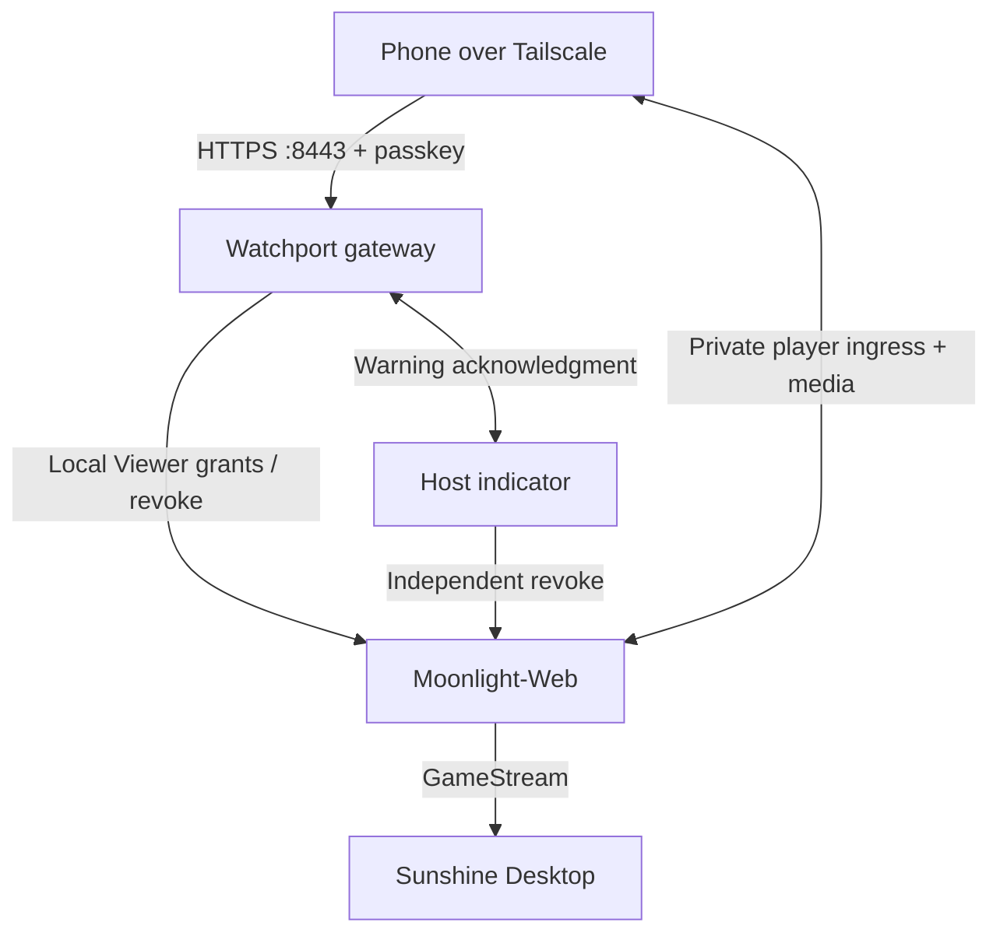

# Watchport

**A passkey-gated, low-latency, view-only window into your own desktop.**

Watchport is a deliberately small security/control plane around Sunshine + Moonlight-Web. Open a private HTTPS page over Tailscale, authenticate with a passkey, and Watchport mints a short-lived **backend-enforced Viewer** capability. The host displays a persistent warning for the entire view.

Watchport is intentionally **not remote desktop**.

## What is implemented

- WebAuthn/passkey authentication with required user verification
- one-time first-passkey bootstrap token (no localhost-origin WebAuthn hack)
- loopback-only gateway; intended publication through Tailscale Serve
- short authenticated sessions + CSRF protection
- ephemeral Moonlight-Web player-slot creation per Watchport stream
- forced `Viewer` permissions (`gamepad=false`, `keyboardMouse=false`) verified before admission
- local redemption of Moonlight's share PIN; the browser receives only its scoped `mw_player` cookie
- refusal to operate if Moonlight-Web Internet Access/public rendezvous is enabled
- separate always-on-top host indicator with GUI render acknowledgment before admission
- browser heartbeat so abandoned/suspended viewers are reclaimed
- gateway watchdog that revokes streams when authentication/indicator/viewer state expires
- **independent indicator failsafe** that directly revokes Watchport-owned Moonlight slots if the gateway disappears
- verified startup/shutdown stale-slot cleanup; partial failures block admission
- privacy-preserving audit log (metadata only)
- configuration validation that refuses non-loopback gateway/control binds
- automated security/invariant tests + GitHub CI/Dependabot
- `watchport-doctor`, Mac LaunchAgent tooling, and an evidence-gated acceptance recorder
- phone background/reconnect handling with deliberate reopening and revocation before retry

## Security invariants

1. **Private network only.** Watchport itself binds only to loopback. Publish it with Tailscale Serve; do not use Funnel.
2. **Passkey separately required.** Tailnet membership alone never authorizes the view.
3. **View-only below the UI.** Moonlight-Web's player worker receives Viewer permissions; Watchport checks those flags before it releases the capability.
4. **Host awareness.** New capability release waits for a fresh GUI warning acknowledgment. Loss of indicator/GUI liveness triggers revocation; physical visibility and teardown still require Mac acceptance.
5. **Two-way failure handling.** If the gateway loses the indicator, the gateway revokes Moonlight slots. If the indicator loses the gateway, the indicator independently revokes the same dedicated slots.
6. **No persistent Moonlight credential.** Watchport obtains Moonlight-Web's localhost-only rotating admin key, generates a one-use local PIN, creates an ephemeral owner session, performs the operation, then logs out.
7. **No public Moonlight rendezvous.** Internet Access must be explicitly disabled before new activation, and the returned link must be local-only. Player ingress must independently isolate management APIs.

See [`docs/SECURITY.md`](docs/SECURITY.md) and [`AGENTS.md`](AGENTS.md).

## Data plane



The player ingress is a **remaining implementation and acceptance gate**. Read [PLAYER-INGRESS.md](docs/PLAYER-INGRESS.md) before exposing Moonlight; a generic proxy to its localhost server can expose owner APIs.

The preferred deployment keeps Watchport's HTTP listener private on loopback. Moonlight-Web's own **Internet Access must remain disabled**. During live setup we will choose the best Tailscale-only exposure for Moonlight signaling/media while preserving direct WebRTC where possible.

## First setup commands

After cloning:

```bash
python3.12 -m venv .venv
# Windows: .venv\Scripts\activate
# macOS/Linux: source .venv/bin/activate
pip install -e '.[dev]'
```

For the target Mac, follow [MAC-AGENT-HANDOFF.md](docs/MAC-AGENT-HANDOFF.md). Begin with:

```bash
.venv/bin/python -m watchport.host init --hostname YOUR-DEVICE.YOUR-TAILNET.ts.net
```

This creates a private local config with a random indicator secret and gateway port 8787. Complete the actual host/app configuration locally. It does not install capture software or publish network routes. The guide covers passkey enrollment, private ingress, live failure tests, latency measurement and LaunchAgents.

General background: [SETUP.md](docs/SETUP.md). Mac install/recovery: [MAC-OPERATIONS.md](docs/MAC-OPERATIONS.md).

## Commands

- `watchport` — gateway
- `watchport-indicator` — persistent host indicator/failsafe
- `watchport-bootstrap` — show/create the one-time first-passkey enrollment token
- `watchport-doctor` — validate Moonlight-Web control integration and enumerate paired hosts/apps
- `watchport-host` — private config and Mac user LaunchAgents
- `watchport-acceptance` — record target evidence and evaluate readiness

## Non-goals

No keyboard, mouse, touch injection, clipboard, file transfer, remote shell, microphone upstream, arbitrary commands, reboot/shutdown, or public cloud relay is part of Watchport V1.

If remote control is ever added, it should be a **separate service, port, grant and authentication ceremony** rather than an option on the permanent Viewer path.

## Licensing

Watchport original code is MIT. Sunshine and Moonlight-Web are separately installed/runtime-integrated GPL components; their source is not vendored into this repository. See [`docs/LICENSING.md`](docs/LICENSING.md).

## Status

**Integration preparation (`0.3.0.dev1`).** The security/control-plane code is implemented and unit/integration-testable without a desktop. The remaining work intentionally requires a real host: install/pair Sunshine + Moonlight-Web, choose the Desktop app, confirm Tailscale-only routing, exercise WebAuthn on real devices, measure latency, and physically test every kill path.

Current completed work, blockers and four milestones: [BUILD_STATUS.md](docs/BUILD_STATUS.md). No deployment should be called production-ready until [`docs/LIVE-ACCEPTANCE.md`](docs/LIVE-ACCEPTANCE.md) passes on the target system.
